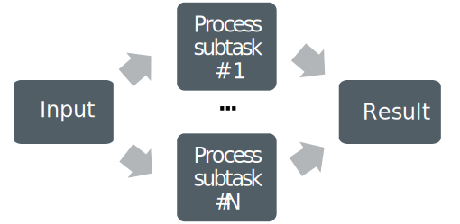
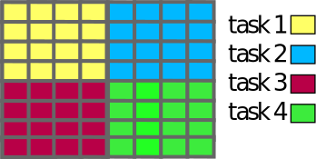
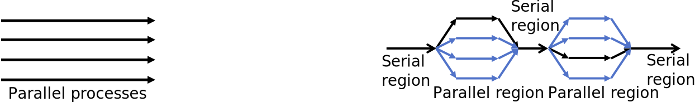
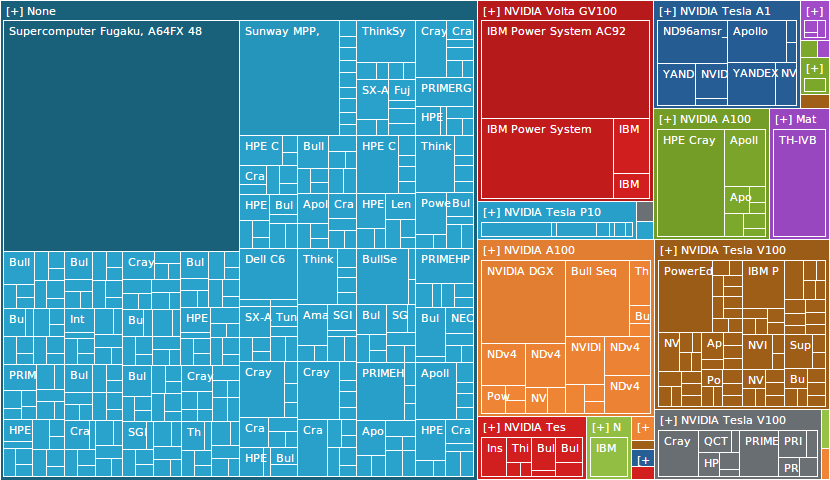
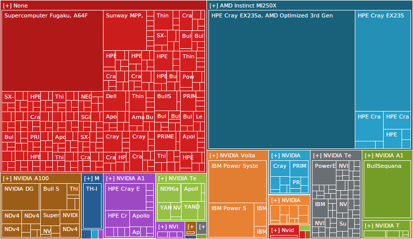
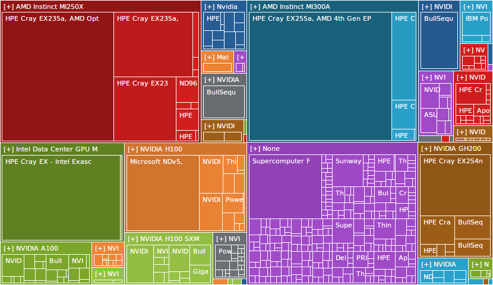

# Parallel computing concepts {.section}

# Computing in Parallel

<div class=column>
- Parallel computing
  - A problem is split into smaller subtasks
  - Multiple subtasks are processed simultaneously using multiple computing units
- Parallel overheads
  - Additional operations which are not present in serial calculation
  - Synchronization, redundant computations, communications

</div>
<div class=column>
<!-- Copyright CSC -->
 {.center width=100%}
</div>


# Exposing Parallelism: Data Parallelism

<div class=column>
- Data parallelism
  - Data is distributed across cores
  - Each core performs simultaneously (nearly) identical operations with different data
  - Cores may need to interact with each other, e.g. exchange information about data on domain boundaries
</div>
<div class=column>

<!-- Copyright CSC -->
 {.center width=80%}

</div>


# Exposing Parallelism: Tasking

- Task farm (main / worker)

<!-- Copyright CSC -->
 {.center width=60%}

<br>

- Main worker sends tasks to workers and receives results
- There are normally more tasks than workers, and tasks are assigned dynamically


# Parallelizable Problems

There needs to be independent computations<br><br>

<div class=column>
Gauss-Seidel iteration:
```
while True:
  for i:
    u[i] = (u[i-1] + u[i+1]
            - h**2 * f[i]) / 2

until converged(u)
```

Loop cannot be parallelized over `i` due to data dependency

</div>
<div class=column>
Jacobi iteration:
```
while True:
  for i:
    u_new[i] = (u_old[i-1] + u_old[i+1]
                - h**2 * f[i]) / 2
  swap(u_new, u_old)
until converged(u)
```

Loop can be parallelized over `i`

</div>

# Data Distribution: Load Balance

<div class=column>
Simple domains with similar computational cost

<br>
<!-- Copyright CSC -->
{.center width=95%}
</div>

<div class=column>
Simple domains with different computational cost

<br>
<!-- Copyright CSC -->
{.center width=49%}
</div>

# Parallel Programming Models {.section}

# Parallel Programming Models

<!-- Copyright CSC -->
 {.center width=80%}
<div class=column>
**MPI: Processes**

- Independent execution units
- MPI launches N processes at application startup
- Works over multiple nodes
- Data exchange via messages
</div>
<div class=column>

**OpenMP: Threads**

- Threads share memory space
- Threads are created and destroyed  (parallel regions)
- Limited to a single node
- Data visible by all threads

</div>

# GPU Programming Models

{.center width=40%}
<br>

- CPU launches kernel on GPU
- Kernel execution is normally asynchronous
    - CPU remains active
- Multiple kernels may run concurrently on same GPU


# Supercomputers {.section}


# Anatomy of a Supercomputer

<!-- Copyright CSC -->
{.center width=100%}


# Current Supercomputers

<div class=column>
- Large computer clusters
- A lot of standard, high-end server hardware connected to each other
- High-speed interconnect between compute nodes
- Example: LUMI
  - 2064 CPU nodes<br>(~260,000 CPU cores in total)
  - 2978 GPU nodes<br>(~12,000 MI250X GPUs in total) 
</div>
<div class=column>
<center>
{.center width=80%}
<small> EuroHPC JU LUMI (HPE Cray EX) at CSC (2021–) </small>
</center>
</div>

# GPUs: The New Default for Performance <!-- GPUs are becoming the norm -->

<center>
{.center width=65%}

- Top500 supercomputers grouped by the accelator type (Nov 2021 list)
</center>

# GPUs: The New Default for Performance <!-- GPUs are becoming the norm -->

<center>
{.center width=65%}

- Top500 supercomputers grouped by the accelator type (Nov 2022 list)
</center>

# GPUs: The New Default for Performance <!-- GPUs are becoming the norm -->

<center>
{.center width=65%}

- Top500 supercomputers grouped by the accelator type (Nov 2024 list)
</center>


# Summary

- Parallel Computing: data is splitted in small independent parts
  -Data  vs. Task Parallelism
- Parallelization causes an extra cost not present in a serial program
  - Data distribution: load balance
- Parallel programming models:
  - Processes vs. Threads (include GPU programming model)
- Parallel Programs run on Supercomputers
  - Nodes, Fast Interconect, Parallel Storage Servers
  - LUMI: 2064 CPU nodes (~260k CPU cores), 2978 GPU nodes (~12k MI250X)
  - GPUs are becoming the norm 
