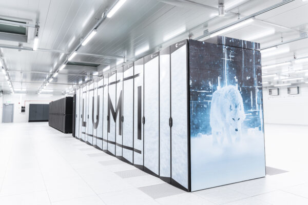

# LUMI and Mahti supercomputers {.section}

# Outline

- Introduction to LUMI and Mahti
- Connecting
- Using Slurm batch job system
- Modules and compiling

# Web resources

- LUMI User guide: <https://docs.lumi-supercomputer.eu/>
- CSC User guide: <https://docs.csc.fi/>
- General Slurm documentation: <https://slurm.schedmd.com/>

# LUMI supercomputer

- LUMI is pan-European supercomputer hosted by CSC
    - user support is distributed to LUMI consortium countries
- For Finnish users access is via CSC
- Over 10 000 AMD GPUs
- "small" (about the size of Mahti) CPU partition
- auxiliary partition for data-analytics with lots of memory (32 TB per node)

{.center width=90%}

# Mahti supercomputer

- Current national flagship system
- 1404 nodes with AMD CPUs, 128 cores per node
- 24 nodes with NVIDIA A100 GPUs
    - subset can be sliced to smaller GPUs for interactive workloads,
      code development etc.
- To be replaced by Roihu (AMD CPUs and NVIDIA Grace Hopper superchips)

# Performance analysis with Rocprof and Nsight Systems {.section}

# Rocprof

- AMD performance analysis and tracing tool
- Visual analysis via web browser
    - <https://ui.perfetto.dev/>

# Nsight Systems

- NVIDIA performance analysis and tracing tool
- GUI for visual analysis
    - Recommended to install on local workstation for smoother respose
    - <https://developer.nvidia.com/nsight-systems/get-started>
