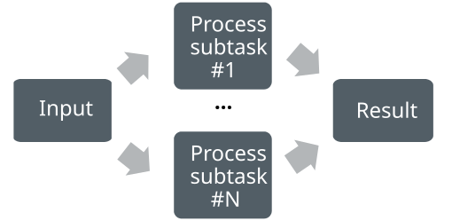
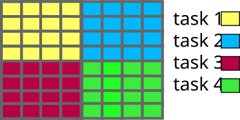
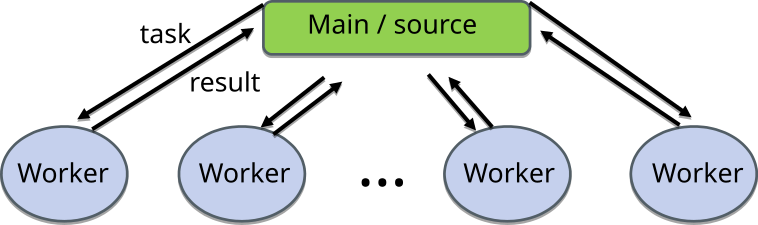
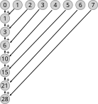
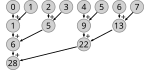
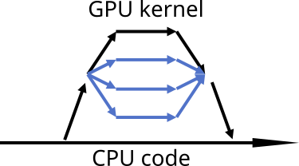

<!--
SPDX-FileCopyrightText: 2010 CSC - IT Center for Science Ltd. <www.csc.fi>

SPDX-License-Identifier: CC-BY-4.0
-->

---
title: Introduction to <br>high-performance computing
event: Portable GPU Programming 2026
lang:  en
---

# Outline

*High-performance computing (HPC) is the use of supercomputers and<br>computer clusters to solve advanced computation problems.*<br>
− [Wikipedia](https://en.wikipedia.org/wiki/High-performance_computing)
<br>
<br>

- Why to use supercomputers?
- What are supercomputers?
- Current trends in high-performance computing


# Why to use supercomputers? {.section}

# Supercomputer application areas

- Supercomputers enable solving computation problems that are impossible or too slow to solve on a standard computer
- Application areas are everywhere
  - Climate, weather, and earth sciences
  - Chemistry and material science
  - Particle physics and cosmology
  - Life sciences and medicine
  - Renewable energy and fusion research
  - Engineering
  - Large-scale AI
  - ...

# What are supercomputers? {.section}

# Early supercomputers

<div class=column>
- Specialized hardware, substantially faster than other computers at the time
- Examples
  - CDC 6600 (1964):<br>
    CPU 10 MHz, 982 kB RAM
  - Cray-1 (1975):<br>
    CPU 80 MHz, 8.4 MB RAM
  - Cray X-MP (1982):<br>
    CPU 4x ~110 MHz, 128 MB RAM
</div>
<div class=column>
<center>
{.center width=100%}
Cray X-MP at CSC (1989)<br>
<small>Image: CSC Archives</small>
</center>
</div>

# Current supercomputers

<div class=column>
- Large computer clusters
- A lot of standard, high-end server hardware connected to each other
- High-speed interconnect between compute nodes
- Example: LUMI
  - 2064 CPU nodes<br>(~260,000 CPU cores in total)
  - 2978 GPU nodes<br>(~12,000 MI250X GPUs in total)
</div>
<div class=column>
<center>
{.center width=100%}
EuroHPC JU LUMI (HPE Cray EX) <br>at CSC (2021–)<br>
<small>Image: Mikael Kanerva (CSC)</small>
</center>
</div>

# Anatomy of a supercomputer

<center>
{.center width=55%}
LUMI supercomputer<br>
<small>Image: Mikael Kanerva (CSC)</small>
</center>


# Supercomputer nodes

 {.center width=55%}

- Supercomputers consist of nodes connected by a high-speed network
  - Latency `~`1 µs, bandwidth `~`100 GB / s
- A node can contain several multicore CPUs and several GPUs
- Permanent storage is accessed via network (shared resource among *all* users)


# Parallel processing

- Modern supercomputers (and regular computers) rely on multiple levels of parallel processing
- **Parallelization within a GPU and multicore CPU**
- Parallelizetation over GPUs and multicore CPUs within a node
- Parallelization over nodes


# Performance of supercomputers

<div class=column style=width:59%>
- Performance is often measured in floating point operations per second (flop/s)
- [LUMI (GPU partition)](https://top500.org/system/180048/)
  - Linpack: 380 PFlop/s (FP64)
  - (Theoretical: 530 PFlop/s (FP64))
  - Power: 7.1 MW &rarr; 54 GFlop/s/W (FP64)
- [LUMI (CPU partition)](https://top500.org/system/180045/)
  - Linpack: 6.3 PFlop/s (FP64)
  - (Theoretical: 7.6 PFlop/s (FP64))
  - Power: 1.2 MW &rarr; 5.3 GFlop/s/W (FP64)
</div>
<div class=column style=width:39%>
<center>
{.center width=100%}
<small>Image: <https://top500.org/statistics/perfdevel/></small>
</center>
</div>


# GPUs have become the norm

<center>
{.center width=60%}

Top500 supercomputers grouped by the accelator type (Nov 2021 list)<br>
<small>Image: <https://top500.org/statistics/treemaps/></small>
</center>

# GPUs have become the norm

<center>
{.center width=60%}

Top500 supercomputers grouped by the accelator type (Nov 2022 list)<br>
<small>Image: <https://top500.org/statistics/treemaps/></small>
</center>

# GPUs have become the norm

<center>
{.center width=60%}

Top500 supercomputers grouped by the accelator type (Nov 2023 list)<br>
<small>Image: <https://top500.org/statistics/treemaps/></small>
</center>

# GPUs have become the norm

<center>
{.center width=60%}

Top500 supercomputers grouped by the accelator type (Nov 2024 list)<br>
<small>Image: <https://top500.org/statistics/treemaps/></small>
</center>

# GPUs have become the norm

<center>
{.center width=60%}

Top500 supercomputers grouped by the accelator type (Nov 2025 list)<br>
<small>Image: <https://top500.org/statistics/treemaps/></small>
</center>

# Why GPUs have become a norm?

- Very high performance for certain workloads
    - With theoretical double precision (FP64) performance specs, 
      LUMI GPU node is **38** times more powerful than LUMI CPU node
- GPUs are also more energy efficient
    - With theoretical double precision (FP64) performance flop per Watt, 
      LUMI GPU node is **10** times more efficient than LUMI CPU node
- For AI workloads with low precision the differences are even higher
- For traditional HPC workloads future trend is not so clear
    - Roihu-GPU node is only **2-4** times more energy effiecient than Roihu-CPU
    - In June 2026, the most powerful supercomputer is based on CPUs


# Parallel computing and programming {.section}

# Outline

- Parallel computing concepts
- Parallel algorithms
- Parallel programming


# Computing in parallel

<div class=column>
- A problem is split into smaller subtasks
- Multiple subtasks are processed simultaneously using multiple computing units
- Subtasks may need to exchange information and synchronize

</div>
<div class=column>
 {.center width=100%}
</div>

# Compute partitioning and data partitioning

- Compute partitioning
    - Which computing unit calculates what
    - Subtasks may all involve same operations or consist of different operations
- Data partitioning
    - Data may be replicated (or shared) between computing units or distributed between them
        - Often subset of data is shared (e.g. within a node)
    - If data cannot fit to a single node or to a single GPU, distribution is required
- In HPC workloads compute and data are typically aligned


# Exposing parallelism: Data parallelism

<div class=column>
- Data parallelism
  - Each computing unit performs simultaneously (nearly) identical operations with different data
  - Data is typically also distributed to computing units
</div>
<div class=column>
 {.center width=70%}
</div>


# Exposing parallelism: Tasking

<div class=column>
- Task farm (main / worker)
- Main worker sends tasks to workers and receives results
    - Duty of main worker may be carried out by parallel runtime
- There are normally more tasks than workers, and tasks are assigned dynamically
    - Tasks may be of different nature, and have dependencies between them
</div>
<div class=column>
 {.center width=70%}
<br>

- Video processing pipeline with four stages
    - 1. a task is decoding frame N
    - 2. a task is applying filters to frame N-1
    - 3. a task is encoding frame N-2
    - 4. a task is writing frame N-3 to disk
</div>

# What can be calculated in parallel?

There needs to be independent computations<br><br>

<div class=column>
Gauss-Seidel iteration:
```
while True:
  for i:
    u[i] = (u[i-1] + u[i+1]
            - h**2 * f[i]) / 2

until converged(u)
```

Loop cannot be parallelized over `i` due to data dependency

</div>
<div class=column>
Jacobi iteration:
```
while True:
  for i:
    u_new[i] = (u_old[i-1] + u_old[i+1]
                - h**2 * f[i]) / 2
  swap(u_new, u_old)
until converged(u)
```

Loop can be parallelized over `i`

</div>


# Parallel algorithms {.section}

# Calculating a sum of numbers

```
  23 + 99 = ...
```

# Calculating a sum of numbers

```
  23 + 99 + 97 + 62 =  ...
```

# Calculating a sum of numbers

```
  23 + 99 + 97 + 62 + 40 + 30 + 72 + 19 + 88 + 12 + 14 + 66 +  4 + 61 + 49 + 58 + 39 + 28 + 86 + 84
= ...
```

# Calculating a sum of numbers

```
  23 + 99 + 97 + 62 + 40 + 30 + 72 + 19 + 88 + 12 + 14 + 66 +  4 + 61 + 49 + 58 + 39 + 28 + 86 + 84
+ 65 + 92 + 49 + 48 + 93 + 75 + 32 + 82 + 92 + 75 + 31 +  8 + 55 + 70 +  1 + 80 + 23 + 78 + 73 + 62
+ 11 + 31 + 99 + 50 + 26 + 82 + 98 + 22 + 82 + 48 + 85 + 69 + 71 + 60 + 27 + 55 + 29 +  7 +  9 + 99
+ 86 + 36 + 95 + 50 + 94 + 87 + 69 +  7 + 59 + 85 + 22 + 50 +  5 + 70 +  5 + 59 + 94 + 69 + 48 + 50
+ 45 + 73 +  2 + 64 + 93 + 50 + 72 +  5 + 66 + 21 + 84 + 33 + 12 + 58 + 35 + 42 + 63 + 33 +  5 + 22
+ 70 + 91 + 71 + 97 + 79 + 13 +  2 +  8 +  3 + 41 + 50 + 74 + 28 + 87 + 39 + 41 +  2 + 72 + 23 + 19
+ 26 + 32 + 64 + 66 + 61 + 29 + 30 + 48 +  8 + 64 + 34 + 75 + 20 +  1 + 97 + 14 + 37 + 46 + 56 + 88
+ 85 + 88 + 79 + 78 + 50 + 25 + 95 + 77 + 17 + 36 + 68 +  3 + 19 + 62 +  1 + 24 + 88 + 33 + 43 + 82
+ 17 + 98 + 20 + 19 + 88 +  8 + 60 + 85 + 35 + 27 + 67 + 77 + 69 + 70 +  2 + 80 + 58 +  1 +  7 + 98
+ 98 + 14 + 41 +  2 + 27 + 73 +  8 + 68 + 43 + 66 + 20 + 52 + 97 + 67 + 42 + 21 + 12 + 37 + 65 + 90
+ 93 + 49 + 25 + 34 + 55 + 77 + 63 +  9 + 75 + 47 + 74 + 80 + 33 + 62 + 62 + 51 + 42 + 29 + 13 + 87
+  4 + 73 + 59 +  5 + 26 + 83 + 90 + 93 + 35 + 81 + 14 + 14 + 53 + 15 + 62 +  3 + 28 + 31 +  8 + 36
+ 48 + 34 + 83 +  8 +  4 + 88 + 84 + 49 + 50 + 10 + 68 + 95 + 31 +  5 + 15 + 32 + 11 + 38 + 43 + 40
+ 76 + 29 + 26 + 66 + 57 + 71 + 30 +  8 + 65 + 10 + 66 + 91 + 23 + 91 + 39 + 93 + 75 + 10 + 32 + 95
+ 41 +  8 + 97 + 63 + 20 + 64 + 10 +  8 +  9 + 76 + 48 + 38 + 76 + 82 + 45 +  8 + 61 + 15 + 89 + 57
+ 93 + 80 + 54 + 53 + 64 +  5 + 68 + 28 + 51 + 66 + 51 + 52 + 72 + 54 + 75 + 24 + 68 + 51 +  7 + 91
+ 34 + 85 + 45 + 99 + 21 + 50 +  9 + 21 + 54 + 57 + 72 + 38 + 66 + 94 + 12 + 86 + 23 +  4 + 55 + 39
= ...
```


# Reductions

- Reduction is an operation that combines data from multiple execution units into a single number
  - Typical reduction operations: **sum**, **product**, **max**, **min**
- Many parallel algorithms need reductions *e.g.* integrals over domains
- Many parallel programming libraries provide efficient implementations for reduction

# Reductions - example algorithms
<div class=column>
<center>
Simple
{.center width=80%}
</center>
</div>
<div class=column>
<center>
Tree
{.center width=80%}
</center>
</div>


# Parallel computing bugs

- Some types of bugs are present only in parallel programs
- Race condition
    - Two (or more) computing units ccess shared data concurrently
    - The final outcome depends on the sequence or timing of execution
    - Unpredictable and often leads to bugs
    - Example: Two threads incrementing the same counter simultaneously might overwrite each other’s result
- Deadlock
    - Two (or more) computing units wait indefinitely for each other to release resources (or e.g. to send data)
    - System halts or stalls due to resource unavailability


# Parallel programming models {.section}


# Parallel programming models

- Parallel execution is based on threads or processes (or both) which run at the same time on different CPU cores
- Processes
    - Interaction is based on exchanging messages between processes
    - MPI (Message passing interface), NCCL/RCCL (GPU communication libraries)
- Threads
    - Interaction is based on shared memory, i.e. each thread can access directly other threads data
    - OpenMP, pthreads, CUDA/HIP

# Parallel programming models

 {.center width=80%}
<div class=column>
**MPI: Processes**

- Independent execution units
- MPI launches N processes at application startup
- Works over multiple nodes
</div>
<div class=column>

**OpenMP: Threads**

- Threads share memory space
- Threads are created and destroyed  (parallel regions)
- Limited to a single node

</div>

# GPU programming models

- GPUs are co-processors to the CPU
- CPU controls the work flow:
  - *offloads* computations to GPU by launching *kernels*
  - allocates and deallocates the memory on GPUs
  - handles the data transfers between CPU and GPUs
- GPU kernels run multiple threads
    - Typically much more threads than "GPU cores"
- When using multiple GPUs, CPU runs typically multiple processes (MPI) or multiple threads (OpenMP)

# GPU programming models

{.center width=40%}
<br>

- CPU launches kernel on GPU
- Kernel execution is normally asynchronous
    - CPU remains active
- Multiple kernels may run concurrently on same GPU

# Programming languages

- The de-facto standard programming languages in HPC are (still)
  C/C++ and Fortran
- Higher level languages like Python and Julia are gaining popularity
  - Often computationally intensive parts are still written in C/C++ or Fortran
- Directive based approaches: OpenMP, OpenACC
- Low level GPU programming with CUDA or HIP
- Performance portability (C++) libraries: Kokkos, SYCL, Alpaka, ...
- Deep learning libraries: PyTorch, TensorFlow, JAX, ...

# Performance, portability, and productivity

- With the heterogenous (x86 and ARM CPUs, NVIDIA and AMD GPUs, ...) and constantly evolving
  HPC landscape, how do we ensure well performing applications with modest development and
  maintenance effort? 
- The 3-P (performance, portability, and productivity) challenge in HPC is active research field
    - various metrics have been proposed for quantifying performance portability and productivity
- The rise of AI coding tools may have a major impact for the porting challenges

# Summary {.section}

# Summary

- Supercomputers enable breakthrough science in multiple fields
- Utilizing supercomputers requires parallel computing
- Special algorithms may be needed for parallel programs
  - Optimal algorithm for serial execution is not the as the optimal algorithm for parallelized execution
  - Also the hardware target (GPU vs CPU, details of the exact hardware) affect the algorithm choice
- Main parallel programming models include MPI, OpenMP, CUDA/HIP, and higher-level frameworks
