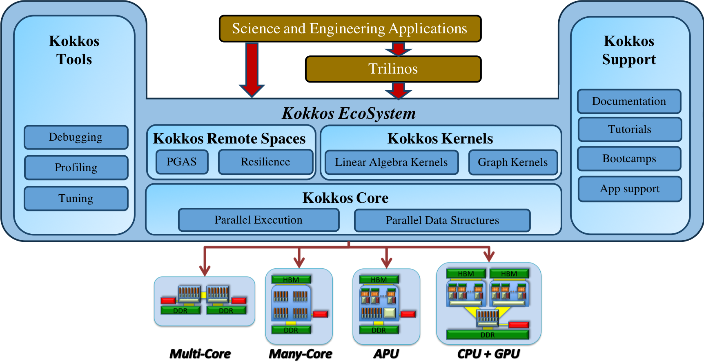

<!--
SPDX-FileCopyrightText: 2025 CSC - IT Center for Science Ltd. <www.csc.fi>

SPDX-License-Identifier: CC-BY-4.0
-->

---
title: Introduction to Kokkos Performance Portability Ecosystem
event: Portable GPU Programming 2025
lang:  en
---

# Learning objectives

- What is Kokkos, and why you might want to use it
- What is included in the Kokkos Ecosystem
- How to install and use Kokkos

# Online resources

- Primary GitHub: <https://github.com/kokkos>
- Lectures: <br>  <https://github.com/kokkos/kokkos-tutorials/wiki/Kokkos-Lecture-Series>
- Wiki with API reference: <https://kokkos.org/kokkos-core-wiki/>
- Slack: <https://kokkosteam.slack.com>

# Introduction to Kokkos {.section}

# Current supercomputer landscape

- CPU only systems with x86 and Arm CPUs
- Heterogenous systems with NVIDIA and AMD (and Intel) GPUs
- Various node level programming approaches
- Kokkos tries to enable a single source performance portable programming on a node level
    - Same program code can be compiled for different hardware architectures

# Kokkos overview

- Kokkos is a C++ ecosystem
    - Linux Foundation project, originally started in Sandia National Laboratories in 2011
    - Part of the US Department of Energies Exascale Project, developed in several
      supercomputing centers in the US and in Europe
- Designed to target complex node architectures with N-level memory hierarchies and multiple types of execution resources
- Abstractions for both parallel execution of code and data management

# Kokkos overview

- Implemented as a C++ template library on top CUDA, HIP, OpenMP, ... 
    - Kokkos is **not** a new language or language extension
    - Works with standard compilers (GCC, Clang, nvcc, hipcc, ...)
- Aims to be descriptive not prescriptive
- Tries to minimize the amount of hardware specific details a programmer must know
- Aligns with developments in the C++ standard


# Kokkos ecosystem

<div class="column" style="width:45%">
- Three main components
- Kokkos Core
    - Parallel Execution and Memory Abstraction
- Kokkos Kernels
    - Sparse, dense, batched math kernels
- Kokkos Tools
    - Profiling and debugging tools
</div>

<div class="column" style="width:53%">
{.center width=95%}
</div>

# Kokkos Core

- Kokkos Core is a programming model for parallel algorithms on shared memory many-core architectures
- The model provides abstractions, such as execution spaces, patterns and policies, as well as memory spaces, layouts and traits
- The developer implements the algorithms using these abstractions which allows Kokkos to map and optimize the code for the desired target architectures
- Kokkos Core offers also some architecture-specific features for further optimization, but this breaks the portability of the code

# Kokkos Kernels

- Kokkos Kernels is a software library featuring linear algebra and graph algorithms for optimal performance across various architectures
- The library is written using the Kokkos Core programming model for portability and good performance
- It includes architecture-specific optimizations and vendor-specific versions of mathematical algorithms
- Kokkos Kernels library reduces the need to develop architecture-specific software, lowering the modification cost for achieving good performance

# Kokkos Tools

- Kokkos Tools is a plug-in software interface with a set of performance measurement and debugging tools for analyzing software execution and memory performance
- It relies on the Kokkos Core programming model interface and uses the user provided labels to identify data structures and computations
- A developer can use these tools for performance profiling and debugging to evaluate their algorithmic design and implementation, and to identify areas for improvement

# Installing and using Kokkos {.section}

# Using Kokkos as external dependency

- Build and install Kokkos with chosen backends
    - At most single device backend can be used
- Add to the project's `CMakeLists.txt` 
```
find_package(Kokkos 4.7 REQUIRED CONFIG) # Find Kokkos version 4.7 or later
# ...
target_link_libraries(MyTarget PRIVATE Kokkos::kokkos)
```
- Point CMake to Kokkos installation with the `Kokkos_ROOT' variable:
```
cmake -DKokkos_ROOT=/path/to/kokkos/installation/ ...
```
- Generally, each backend requires a separate installation

# Embedding Kokkos as part of the project

- Add Kokkos to the project as Git submodule
- Use `add_subdirectory()` in the project's `CMakeLists.txt'
```
add_subdirectory(kokkos)
# ...
target_link_libraries(MyTarget PRIVATE Kokkos::kokkos)
```
- Backend is chosen when building the project, Kokkos with the chosen backend is built alongside

# Summary

- Kokkos is a performance portable C++ programming ecosystem supporting various hardware architectures
- The ecosystem includes three main components, ie, Kokkos Core, Kokkos Kernels, and Kokkos Tools for GPU program development
- Kokkos is implemented as a template library
- Kokkos can be used via standalone installation (as external dependency) or as a part of the project
