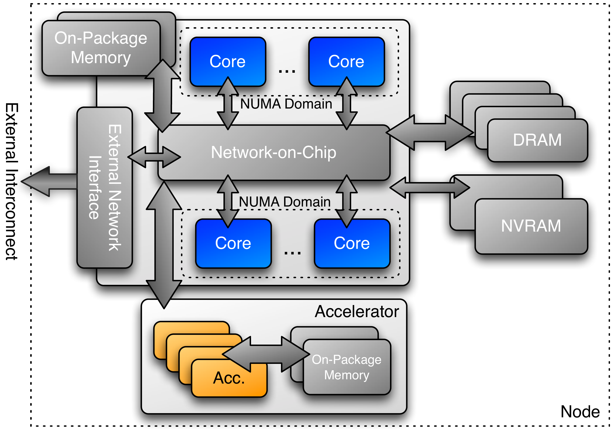

<!--
SPDX-FileCopyrightText: 2025 CSC - IT Center for Science Ltd. <www.csc.fi>

SPDX-License-Identifier: CC-BY-4.0
-->

---
title: Spaces and Views 
event: Portable GPU Programming 2025
lang:     en
---

# Learning objectives

- How Kokkos abstracts heterogenous hardware
- What is Kokkos View
- How to manage heterogenous memory with Kokkos Views


# Parallel dispatch so far

{.center width=85%}

```c++
Kokkos::parallel_for(N,
   [=] (const int i) {
        y[i] += a * x[i];
   });
```
- Where is the lambda executed?
- How to ensure data is in same place as execution?

# Kokkos machine model

<div class="column">
- Multiple execution units in a compute node
- Execution units are capable of parallel processing
- Execution units may have distinct memories
</div>

<div class="column">
{.center width=70%}
</div>

# Execution Space

<div class="column">
- Execution space is a homogenous set of cores
- Execution spaces map into Kokkos backends
    - Serial, OpenMP, CUDA, HIP
- There is always at least one **host** execution space
    - host space may be serial or parallel
</div>
<div class="column">
{.center width=85%}
</div>

# Program execution

- Three kinds of code in a Kokkos program
    1. Code that has nothing to do with Kokkos 
         - runs always on a host
    2. Code outside of a Kokkos parallel operation that asks Kokkos to do something (e.g., parallel dispatch itself) 
         - runs always on a host
    3. Code executing inside of a Kokkos parallel operation
         - runs on a default execution space or on specified execution space

# Choosing execution space

- Default execution space is defined when building Kokkos, *i.e.* when selecting the backends 
- Parallel dispatch operations take a "policy" argument 
```c++
parallel_for(N, ...)
```
is actually a shortcut for
```c++
parallel_for(RangePolicy<Kokkos::DefaultExecutionSpace>,(0, N),  ...)
```
- Using default Host execution space:
```c++
parallel_for(RangePolicy<Kokkos::DefaultHostExecutionSpace>,(0, N),  ...)
```
- In basic cases one most often uses just the default execution space

# Management memory with Kokkos View 

- Kokkos View is a multidimensional array
- Lightweight C++ class with a pointer to data and some metadata
- Datatype, number of dimensions etc. are template parameters 
- Number of dimensions is fixed at compile time
- Extent of a dimension can be specified at compile time or at runtime

# Views

```c++
Kokkos::View<int*> a("a", n); // 1D array with runtime dimension
Kokkos::View<double*[3]> b("b", n); // 2D n x 3 array with compile time dimension
```
- Compile time extents need to be rightmost
- Number of dimensions and extents can be queried with the `rank()` and `extent()` methods
- Runtime dimensions of a View can be resized
- The elements of a view are accessed using parentheses enclosing a comma-delimited list of integer indices
  (similar to Fortran)
```c++
a(5)     // 6th element
b(1, 3)  // 2nd row, 4th column
```

# Views

- Memory is allocated only when explicitly requested
- Memory is automatically deallocated when View goes out of scope (via reference counting)
- Copy construction and assignment behave like with pointers
    - pass Views by value and not by reference
```c++
Kokkos::View<float**> a("a", n), b("b", n)
...
a = b // a becomes alias to b
```
- Copying between Views needs to be done explicitly with a `deep_copy`
```
Kokkos::deep_copy(a, b);  // copy contents of b into a
```

# Memory Space

<div class="column">
- Memory resource that can be explicitly managed
- Host memory, device memory, unified memory
- The data of a View is stored in the memory space defined at compile time
- By default, memory space of a default execution space is used
</div>
<div class="column">
{.center width=85%}
</div>

#  Specifying Memory Space

```c++
Kokkos::View<double**> b("b", n, m);
Kokkos::View<double**, Kokkos::HostSpace> h_b("h_b", n, m);
Kokkos::View<double**, Kokkos::SharedSpace> s_b("s_b", n, m);
```
- Assignments between incompatible device and host memory spaces are not possible
```c++
h_b = b // Error if b is in device (CUDA or HIP) space
h_b = s_b // Ok
```
- Deep copies are possible
```c++
Kokkos::deep_copy(h_b, b) // Works even if b is in device (CUDA or HIP) space
```

# Summary

- Kokkos abstracts the execution and memory resources by Execution and Memory Spaces
- Parallel code runs on default or user specified execution space
- Kokkos provides a View data structure for multidimensional arrays
- The data in View is stored on default or user specified memory space
- Kokkos never copies the data between Views implicitly, but user needs to use 
  `deep_copy()` function
